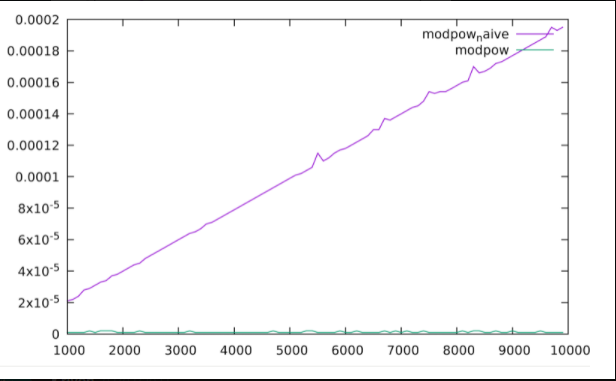

# Projet LU2IN006 - Blockchain appliquée à un processus électoral
Wassim MUSSARD (28706762), Sebastian SZEBRAT (28706848), Camille VANG (28701368)

## Description

La tenue d'un processus électoral pose des questions de
confiance et de transparence épineuses. Le compte des voix 
fait appel à des assesseurs, ce qui en fait un travail avec
peu de garanties de fiabilité. De plus, un candidat ne 
peut pas vérifier a posteriori que sa voix a été comptabilisée
chez le bon candidat. Le processus peut aussi éprouver un 
manque d'ergonomie (par exemple, en ne proposant pas de vote
par correspondance). 

Notre objectif est donc de réflechir sur 
les protocoles et les structures de données à mettre en place
pour permettre d'implémenter efficacement le processus de 
désignation du vainqueur de l'élection, tout en garantissant
l'intégrité, la sécurité et la transparence de l'élection.

## Organisation des fichiers

Le code du projet est divisé dans un répertoire en 5 partie, elle-même divisée en un ou plusieurs exercices. 
Chaque exercice a un fichier .c définissant les fonctions et un header correspondant, et un main
pour tester ces fonctions. Un makefile global situé dans la racine du projet permet de tout compiler, 
accompagné d'un README pour l'utilisation.

## Partie 1

## Développement d'outils cryptographiques

Cette partie comporte les fonctions permettant de chiffrer un
message de façon asymétrique. Nous avons implémenté le protocole RSA.

#### Fonctions principales 

##### Exponentiation modulaire rapide
* `int is_prime_naive(long p)` étant donné un nombre impair $p$, renvoie 1 si $p$ est premier et 0 sinon
* `long modpow_naive(long a, long m, long n)` retourne la 
valeur $a^{b} \bmod n$ 
* `int modpow(long a, long m, long n)` retourne la même valeur que `modpow_naive`, mais en réalisant des élévations au carré pour obtenir une complexité logarithmique

##### Test de Miller-Rabin

Fonctions fournies :  
* `int witness(long a, long b, long d, long p)` teste si $a$ est un témoin de Miller pour $p$, pour un entier $a$ donné
* `long rand_long(long low, long up)` retourne un entier `long` généré aléatoirement entre `low` et `up` (inclus)
* `int is_prime_miller(long p, int k)` réalise le test de Miller-Rabin en générant $k$ valeurs de $a$ au hasard, et en testant si chaque valeur de $a$ est un témoin de Miller pour $p$

##### Génération de nombres premiers

* `long random_prime_number(int low_size, int up_size, int k)` retourne un nombre premier de taille comprise entre `low_size` et `up_size`

##### Génération d'une paire (clé publique, clé secrète)
* `void generate_key_values(long p, long q, long *n, long *s, long *u)` permet de générer la clé publique $pkey = (s,n)$ et la clé secrète $skey = (u,n)$ à partir des nombres premiers $p$ et $q$ (suit le protocole RSA)

##### Chiffrement et déchiffrement des messages

* `long* encrypt (char* chaine, long s, long n)` chiffre la chaîne de caractères `chaine` avec la clé publique $pKey = (s,n)$
* `char* decrypt(long* crypted, int size, long u, long n)` déchiffre un message à l'aide de la clé secrète $skey = (u,n)$

##### Fonction de test

Fonctions fournies :  
* `void print_long_vector(long *result, int size)` affiche la représentation chiffrée d'une chaîne de caractères
* `int main()` contient des tests de cryptage et décryptage

### Description schématique et interprétation de  `is_prime_naive`, `modpow_naive` et `modpow`
 

En conclusion , la fonction  `is_prime_naive` en fonction de $p$ est $O(p)$ car nous faisons $p$ itérations.  En utilisant `is_prime_naive` le plus grand nombre premier généré en moins de 2 millièmes de seconde est 2 . En ce qui concerne `modpow_naive`, nous avons une complexité  de $O(m)$ car nous itérons $m$ fois. Nous avons également analyser la performance des fonctions `modpow_naive` et `modpow`. Comme prévu, la courbe modpow naive est strictement croissante car elle est en $O(m)$, alors que la courbe associée à la fonction modpow est presque confondue avec l'axe des abscisses car elle est en $O(\log2(m))$. On en déduit en comparant leur complexité  `modpow` est bien plus performante que `modpow naive` *(cf. Description schématique des algorithmes)*. Enfin, on sait que au moins $3/4$ des valeurs entre $2$ et $p − 1$ sont des témoins de Miller pour $p$ . Donc pour $k$ tirages on aura une probabilité $(1/4)^k$ pour avoir une erreur de l'algorithme.

### Jeux d'essais

Les jeux d'essais sont concluants. En effet, nous avons obtenu les résultats qui étaient attendus, nous avons également réglé les problèmes de fuites mémoires grâce à Valgrind. 

## Partie 2 

Dans cette nouvelle partie, nous allons essayer de modéliser des déclarations de vote en commençant par la manipulation de structures puis par la création de données. 

#### Structures

`Key` :
* `long` val;
* `long` n;

`Signature` :
* `long*` content;
* `int` size;

`Protected` :
* `Key*` pkey;
* `char*` mess;
* `Signature*` sgn;

#### Fonctions principales 

##### Manipulation de cles 

* `void init_key(Key * key , long val , long n )`, initialise une clé déjà allouée.

* `void init_pair_keys(Key * pKey , Key *sKey ,  long low_size , long up_size )`, initialise une clé publique et une clé secrète.

* `char * key_to_str(Key * key )`, convertit la clé passée en paramètre en `str`. Afin d'optimiser l'espace mémoire nous avons fait un `realloc`.

* `char * str_to_key(char * str )`, convertit `str` en `key`.

##### Signature 

* `Signature * init_signature(long *content , int size )` ,alloue et initialise la structure `Signature`. 

* `Signature * sign(char *mess, Key *sKey )` , retourne une `Signature` à partir de `mess` et de la clé secrète. Pour cela nous utilisons la fonction `long* encrypt(char * chaine, long s , long n)` vu dans l'exercice 2 de la partie 2 .

Fonctions fournies :    
* `char* signature_to_str(Signature *sgn)`, convertit une `Signature` en `str` .

* `Signature* str_to_signature(char *str)`, convertit un `str` en `Signature`  .

##### Déclarations signées 

* `Protected * init_protected(Key * pKey , char * mess , Signature * sgn) `, alloue et initialise la structure `Protected` .

* `int verify(Protected *pr)` , vérifie s'il y a correspondance entre la `Signature` contenue dans `pr`  et le message . Nous utilisons la fonction `char *decrypt(long * crypted, int size , long u , long n)` ce qui va nous permettre de comparer la chaîne en sortie (mess_decrypt) avec `pr->mess`. Si `strcmp(pr->mess,mess_decrypt) == 0`  alors il y a correspondance .

* ` char* protected_to_str`, convertit une structure `Protected` en `str` .  Pour cela on fait appel aux fonctions `char* key_to_str(Key* key) `  et  ` Key* str_to_key(char* str)`. Puis on alloue l'espace mémoire nécessaire pour ` char*` et enfin on libère la mémoire allouée par les variables locales  `char* pKey` et `char* sgn` .

* `Protected * str_to_protected` , convertit un `str` en  une structure `Protected` . Pour cette fonction , la stratégie est de déclarer une variable `char buffer[256] ` puis de parcourir `str` et de stocker dans `buffer` les caractères de `str` jusqu'à rencontrer les différents délimiteurs  : `'  '` ou antislash 0 représentant  respectivement le délimiteur de `pKey`, le `message` et la `signature`. On garde en mémoire ces informations. Enfin on déclare une `Signature *` et un `Protected *` avant de les initialiser.

##### Génération des données

* `void generate_random_data(int nv, int nc) ` , qui va donc nous permettre de modéliser tout le déroulement d'un vote .  Pour cela , on suit tout simplement les différentes étapes données : 

    *   Générer nv couples de clés représentant les nv citoyens et les stocker dans keys.txt :
    
        -> Pour cela on itére `nv` fois et à chaque tour de boucles, on va allouer `pKey` et `sKey` et les stocker respectivement dans `pKeyTab[i] ` et `sKeyTab[i] ` avant de les initialiser avec la fonction  `init_pair_keys(Key* pKey, Key* sKey, long low_size, long up_size)` (ces tableaux nous serviront plus tard). Afin de respecter le format attendu du type : "keys.txt : couple (publique,secrète) pour nv citoyens)" , on a donc utilisé `char* key_to_str(Key* key) ` pour la clé privée , le resultat est stocké dans la variable `pKeyStrTab[i]` . Enfin on fait encore une fois  `char* key_to_str(Key* key) ` mais avec la clé publique avant de `fprintf` de `pKeyStr` et de `sKeyStr` avec `keys` qui est un `FILE * ` du fichier `"keys. txt"` et de `fclose(keys)`.

    * selectionne nc clés publiques, définit nc candidats  et les stocke dans candidats.txt : 

        -> Pour cette deuxième étape , on va cette fois ci itérer  `nc` fois . On prend à chaque tour de boucle un entier *`tirage`* $∈ [0,nv[ $ à l'aide de `rand`, on va ensuite aller chercher le citoyen dans le tableau `pKeyStrTab` *(déclaré et initialisé dans la première étape)* . Enfin  on stocke dans `candidatsPKeyStrTab` la clé publique de chaque citoyens tirés et on fait un `fprintf` de `choix` avec `candidats` qui est un `FILE * ` du fichier `"candidats. txt"` et on fait un `fclose(candidats)`. Ceci va donc nous permettre de tirer de manière aléatoire `nc` citoyens et de les stocker dans notre tableau `candidatsPKeyStrTab` qui va nous servir pour la prochaine et dernière étape . 
    
    * génère une déclaration pour chaque citoyen  :
    
        -> Pour cette dernière étape , on va donc itérer `nv` fois et on va une nouvelle fois tirer de manière aléatoire avec `rand` un entier *`tirage`* entre `0` et `nc` exclus car on a `nc` candidats . Puis le `citoyen[i]` signe à l'aide de la fonction `sign(char* mess, Key* sKey)`,`mess`  référence le candidat pour lequel `citoyen[i]` vote . Enfin , on initialise `prStr` qui est la représentation de "déclaration" sous forme de chaîne de caractères . On affiche `prStr` à l'aide `fprintf` et `déclarations` qui est un `FILE * ` du fichier `"déclarations. txt"` et on fait un `fclose(déclarations)` . Ainsi , on aura généré pour les `nv` citoyens une déclaration générée de manière aléatoire pour un candidat appartenant à `candidatsPKeyStrTab`.

    * On libère toutes les structures allouées .

#### Jeux d'essais

La fonction `void generate_random_data(int nv, int nc) ` fonctionne . En effet elle retourne le resultat attendu sans erreurs de gestion de mémoire .
*(cf. candidats.txt , keys.txt , déclarations.txt)* .

## Partie 3 

## Description

Cette partie va nous permettre de modéliser une base de déclarations centralisée.
Nous aurons besoin d'utiliser la fonction `void generate_random_data(int nv, int nc) ` vue dans l'exercice 4.

#### Structures

`Cellkey` :
* `Key*` data ;
* `struct cellKey*` next ;

`CellProtected` :
* `Protected*` data ;
* `struct cellProtected*` next ;

#### Fonctions principales

##### Liste chaînée de clés 

* `CellKey* create_cell_key(Key* key)`, alloue et initialise une cellule de liste chaînée.

* `CellKey* insert_cell_key(CellKey* LCK, Key* data)`, permet d'ajouter la clé `data` en tête de la liste `LCK`.

* `CellKey* read_public_keys(char* nomFic)`, retourne le contenu de `nomFic` sous la forme d'une liste chaînée.

* `void print_list_keys(CellKey* LCK)`,  affiche `LCK->data` tant que ` LCK != NULL `.

* `void delete_cell_key(CellKey* c)`, libère une cellule.

* `void delete_list_keys(CellKey* LCK)`, libère toute la liste chaînée.
 
##### Liste chaînée de déclarations signées 

* `CellProtected* create_cell_protected(Protected* pr)`, alloue et initialise un `CellProtected`.

* `CellProtected* insert_cell_protected(CellProtected* LCP, Protected* pr)`, ajoute `pr` en tête de `LCP`.

* `CellProtected* read_protected()`, retourne un `CellProtected*` avec toutes les déclarations du fichier `'declarations.txt'`.

* `void print_list_protected(CellProtected* LCP)`, affiche `LCP->data` tant que `LCP != NULL`.

* `void delete_cell_pr(CellProtected* cp)`, libère un élément de type `CellProtected*`.
* `void delete_list_pr(CellProtected* LCP)`, libère toute la liste chaînée.

## Partie 4

Dans cette nouvelle partie, nous allons faire des fonctions qui pourront déterminer le gagnant de l'élection. Pour cela nous allons utiliser une table de hachage.

#### Structures

`HashCell` :
* `Key*` key ;
* `int` val ;

`Hashtable` :
* `HashCell**` tab ;
* `int` size ;

#### Fonctions principales 

* `void delete_fraud(CellProtected* cp)`, supprime de `cp` toutes les signatures non valides. Si la signature est fauduleuse alors on la supprime avec `delete_cell_protected(CellProtected* cp)`.

* `int hash_function(Key* key, int size)`, pour cette fonction nous avons fait une fonction en $O(1)$ et nous utilisons la méthode de la multiplication . Par conséquent nous utilisons  `le nombre d'or`  : $(√(5)-1/2)$ qui nous retournera un  nombre $ x ∈ [0,1[ $. 

* `find_position(HashTable* t, Key* key)`, pour trouver la position de `key` on utilise la fonction `hash_function(Key* key, int size)` . Ensuite , on retourne cette position si `t->tab[pos]->key` est libre ou  `NULL`, sinon soit `key` n'est pas dans `t`, soit `key` a été décalé par probing linéaire . On itère tant qu'on arrive pas à la fin.

* `Key* compute_winner(CellProtected* decl, CellKey* candidates, CellKey* voters, int sizeC, int sizeV)`, pour chaque déclaration la statrégie est d'utiliser la fonction `find_position(HashTable* t, Key* key)` et si  `find_position(hv,tmp->pKey) >= sizeV` alors cela signifie que cette personne n'a pas le droit de voter . On fait de même pour vérifier si le vote porte bien sur un candidat de l'élection : si `find_position(hc,hv->tab[posV]->key)<sizeC` , alors le vote est compatbilisé .

## Partie 5

Dans cette nouvelle partie , nous allons utiliser de nouveau plusieurs structures. La première `Block`permet de créer des blocks, la seconde `Celltree` permet la construction et la manipulation d'un arbre de block. Enfin, nous pouvons simuler l'élection.

#### Structures 

`Block` :
* `Key *` author ,  la clé publique du créateur .
* `CellProtected *` votes , la liste de déclarations de vote .
* `unsigned char *` hash , la valeur hachée du bloc .
* `unsigned char *` previous_hash , la valeur hachée du bloc précédent .
* `int` nonce  , la preuve de travail .

`CellTree` :
* `Block*` block ;
* `struct block_tree_cell *` father ;
* `struct block_tree_cell *` firstChild ;
* `struct block_tree_cell *` nextBro ;
* `int` height ;

#### Fonctions principales 

##### Manipulation de Block
* `char * str_to_hash(char *str )`, nous avons repris la fonction donnée dans l'énoncé . Au lieu , de retourner directement le resultat , nous avons décider de retourner le resultat sous forme `héxadecimal` , afin de faciliter l'opération de `compute_proof_of_work(Block *B, int d)`.

* `compute_proof_of_work(Block *B, int d) `, étant donné que `B->hash` est en `héxadecimal` , on peut directement vérifier si on a $d$ zéro successif . Sinon on modifie  `B->hash` jusqu'à ce que `B->hash` commence par $d$ zéro successif.

##### Manipulation d'un Arbre

* `void add_child(CellTree* father, CellTree* child)`, dans cette fonction on ajoute `child` à `father`. La stratégie est de chercher si `father`a un fils. Si c'est le cas, alors on parcourt les frères du fils et on insère  `child` quand `father->child == NULL`. Sinon, `child` est directement le fils de `father`. Enfin, on met à jour la hauteur de tous les noeuds pères de `child` de l'arbre .

* `CellTree* highest_child(CellTree* cell)`, dans un premier temps on regarde si `cell` a un fils . Dans ce cas on peut alors parcourir ses frères en comparant un à un le champs `height`, et en ne gardant que le maximum . Le noeud possèdant cette hauteur maximale est retourné. 

*  `CellProtected  * fusion_liste(CellProtected * l1 , CellProtected * l2) ` , pour la fusion on  parcourt `l1` (en $O(n)$) puis on  parcourt `l2` (en $O(m)$) en insérant chaque éléments de `l2` en fin de liste . Nous avons donc une complexité en $O(n*m)$.Toutefois , il est possible d'avoir une complexité en $O(1)$ . En effet , il faudrait que le dernier élément ait un pointeur vers le premier élément et que le premier élément ait aussi un pointeur vers le dernier élément . C'est la structure *$circulaire$* , en effet on aura juste à reaffecter le pointeur de la première  tête de liste vers le dernier élément de la deuxième liste , opération en $O(1)$, et le pointeur de la deuxième tête de liste vers le dernier élément de la première liste , également en $O(1)$.

* `CellProtected* liste_declaration_block(CellTree* tree)` , pour cette fonction on utilise  `CellTree* highest_child(CellTree* cell)` ,  nous permettant ainsi d'être sur la chaîne la plus longue tant que  `highest_child(tree)!= NULL ` et on utilise la fonction `CellProtected  * fusion_liste(CellProtected * l1 , CellProtected * l2) ` , pour retourner un `CellProtected *` . 

##### Simulation de l'élection

* `void create_block(CellTree* tree, Key* author, int d)`, crée un block ayant pour previous_hash la valeur hachée du dernier noeud de l'arbre. Écris le block dans un fichier `Pending_block.txt`.

* `void add_block(int d, char* name)`, crée un fichier `name` dans le repertoire Blockchain contenant le block lu à partir du fichier `Pending_block.txt` si et seulement si le block est valide. Supprime `Pending_block.txt`.

* `CellTree* read_tree(int d)`, permet de construire l'arbre contenant tous les blocks. Lis les fichiers un à un crée par `add_block(int d, char* name)`précedemment du repertoire Blockchain. L'arbre dans la fonction est construit à partir d'un tableau de `CellTree*`, ainsi nous pouvons reconstruire l'arbre à partir des valeurs hachées précédentes de chaque block. Renvoie la racine de l'arbre.

### Fonctions secondaires

* `Block* create_block_test(unsigned char * previous_hash, int d)`, nous avons décidé d'implémenter cette fonction afin de faciliter les tests lors de la création d'un arbre.

### Description schématique et interprétation de `time_compute_proof_of_work` 
 

Cette courbe représente le temps en secondes que met l'exécution `compute_proof_of_work` en fonction du nombre de zéros requis . On constate qu'elle est bien exponentielle. De plus, on remarque qu'on dépasse $1$ seconde lorsque $d=5$. Ainsi cela limite le nombre de 0 requis à 4.

### Jeux d'essais

Pour les jeux de test concernant l'arbre, on crée un arbre à 5 noeuds : la hauteur de la racine est de 2, le premier fils n'a pas d'enfant. Toutes les fonctions sont appliquées sur cet arbre. 

##### Fonctionnement de la blockchain 
Concernant l'élection, on commence par créer des données : déclarations, voteurs, candidats. Tous les 10 votes, on crée un fichier contenant un block crée à partir de ces votes. 

### Problèmes éventuels
La génération des blocks dans l'arbre est faussée : ils sont simplement mis à la suite des uns et des autres, car nous n'avons pas pu déterminer quels sont les previous_hash correspondant. 

### Conclusion

L'utilisation d'une Blockchain est très coûteuse en mémoire, car il faut générer beaucoup de block. De plus, bien que faire confiance à la plus longue chaîne permet d'éviter un certain nombre de fraude, il n'est pas impossible qu'un block frauduleux se glisse à la toute fin d'une branche, à hauteur égale de la plus longue. Ce système n'est donc pas 100% fiable.
